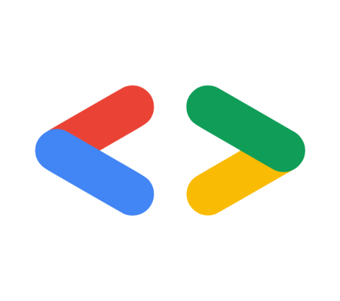

# GDSC Learn App

Welcome to the GDSC Learn App, your one-stop destination for acquiring a wide range of technical and non-technical skills while tracking your progress along the way. Whether you're an aspiring developer, designer, marketer, or simply someone eager to expand your knowledge, GDSC Learn has something for everyone.

## Table of Contents

- [About GDSC Learn](#about-gdsc-learn)
- [Features](#features)
- [Getting Started](#getting-started)
- [App Flow Chart](#flow-chart)
- [Contributions](#contributing)
- [Figma Link](#figma-design)
- [Usage](#usage)

## About GDSC Learn

GDSC Learn is an innovative educational platform created by the Google Developer Student Clubs (GDSC) community. Our mission is to empower individuals to thrive in the digital age by offering a wide array of courses and resources for both tech and non-tech skills. We believe in lifelong learning and the transformative power of education.

## Features

### 🚀 Skill Development

- Access a diverse range of courses, tutorials, and learning materials.
- Learn from industry experts and experienced educators.
- Choose from tech (programming, web development, data science, etc.) and non-tech (leadership, communication, entrepreneurship, etc.) skills.

### 📊 Progress Tracking

- Monitor your progress in real-time.
- Track completed courses and achievements.
- Set personal goals and targets for your learning journey.

### 🌟 Interactive Learning

- Engage in hands-on projects and exercises.
- Join discussion forums and connect with fellow learners.
- Receive feedback and support from a thriving community.

## Getting Started

To get started with GDSC Learn, follow these simple steps:

1. **Sign Up**: Create a GDSC Learn account or log in if you already have one.

2. **Browse Courses**: Explore our extensive library of courses and choose the ones that align with your interests and goals.

3. **Learn and Grow**: Dive into your selected courses, complete assignments, and watch your skills flourish.

4. **Track Progress**: Monitor your progress on the dashboard, earn badges, and achieve milestones.

## Usage

Once you've installed the GDSC Learn App, you can easily access all the features and content. Here's a quick overview of how to use the app:

1. **Login**: Use your GDSC Learn credentials to log in.

2. **Browse Courses**: Explore the course catalog and filter by category, skill level, and more.

3. **Enroll**: Select a course you're interested in, and click "Enroll" to start learning.

4. **Learn**: Complete lessons, assignments, and quizzes. Engage with the community and your fellow learners.

5. **Track Progress**: Monitor your progress on your dashboard. Celebrate your achievements!

## Flow Chart

## Main Screen

- Home Tab
  - Popular Courses
    - Course Details Page
      - About Tab
      - Lessons Tab
      - Reviews Tab
  - Ongoing Courses
    - Course Details Page
      - About Tab
      - Lessons Tab
      - Reviews Tab
- My Courses Tab
  - Ongoing Courses
    - Course Details Page
      - About Tab
      - Lessons Tab
      - Reviews Tab
  - Completed Courses
    - Course Details Page
      - About Tab
      - Lessons Tab
      - Reviews Tab
- Bookmarks Tab
  - List of Bookmarked Courses
    - Course Details Page
      - About Tab
      - Lessons Tab
      - Reviews Tab
- Profile Tab
  - User Profile Information

## Contributing

We welcome contributions from the GDSC community and beyond. If you'd like to contribute to GDSC Learn, please follow these general instructions:

1. **Check for Issues**: Visit our [Issues](https://github.com/developer-student-club-thapar/dsc-learn-app/issues) page to find a list of open issues and new features to work on.

2. **Fork the Repository**: Click the "Fork" button in the upper right corner to create your copy of the repository.

3. **Clone the Repository**: Clone your forked repository to your local machine using `git clone`.

4. **Create a Branch**: Create a new branch for your work using a descriptive branch name. For example: `git checkout -b fix-issue-123`.

5. **Make Changes**: Make your desired changes or additions to the codebase.

6. **Commit Changes**: Commit your changes with a clear and concise commit message.

7. **Push Changes**: Push your changes to your forked repository on GitHub.

8. **Create a Pull Request**: Visit the original repository and click the "New Pull Request" button. Provide a clear title and description for your PR, and link it to the relevant issue (if applicable).

9. **Review and Collaborate**: Collaborate with maintainers and other contributors to address feedback and make necessary revisions to your PR.

10. **Merge PR**: Once your PR is approved, it will be merged into the main repository. Congratulations on your contribution!

## Figma Design

You can find the design and mockups for the GDSC Learn App on [Figma](https://www.figma.com/file/Q4g8FlUN1MJJpg0uNVdxri/GDSC-Learn-Portal?type=design&node-id=1-319&mode=design&t=iRUF7rHO1PFoCxH1-0).

## Thank You

Start your learning journey today with GDSC Learn, and unlock a world of opportunities to acquire new skills and grow both personally and professionally. Happy learning! 🌟🚀

For any questions, feedback, or support, please contact us at our instagram page.
